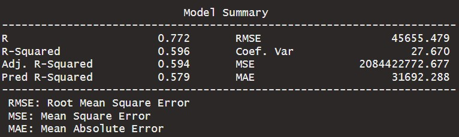
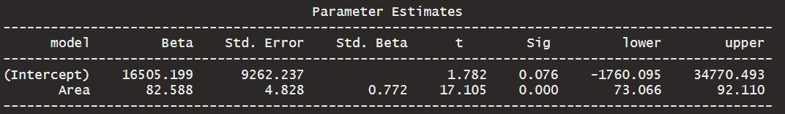

```{r setup, include=FALSE, echo=FALSE}
options(htmltools.dir.version = FALSE)
knitr::opts_chunk$set(
  fig.retina=2,
  #out.width = "75%",
  #out.height = "50%",
  htmltools.preserve.raw = FALSE,      # needed for windows
  scipen=100,                          # suppresses scientific notation
  getSymbols.warning4.0 = FALSE,       # suppresses getSymbols warnings
  cache = FALSE,
  echo = TRUE,
  hiline = TRUE,
  message = FALSE, 
  warning = FALSE
)


# install helper package (pacman)
# pacman loads and installs other packages, if needed
if (!require("pacman")) install.packages("pacman", repos = "http://lib.stat.cmu.edu/R/CRAN/")

# install and load required packages
# pacman should be first package in parentheses and then list others
pacman::p_load(pacman,tidyverse, magrittr, olsrr, gridExtra, ggiraphExtra, knitr, viridis, png)

# verify packages (comment out in finished documents)
p_loaded()


```

```{r xaringan-themer, include=FALSE, warning=FALSE}
library(xaringanthemer)

palette <- c(
  SU_Orange1        = "#F76900",
  SU_Orange2        = "#FF8E00",
  SU_Red_Orange     = "#FF431B",
  SU_Blue1          = "#000E54",
  SU_Blue2          = "#203299",
  SU_Light_Blue     = "#2B72D7",
  SU_White          = "#FFFFFF",
  SU_Light_Gray     = "#ADB3B8",
  SU_Medium_Gray    = "#707780",
  SU_Black          = "#000000", 
  
  steel_blue        = "#4682B4",
  corn_flower_blue  = "#6495ED",
  deep_sky_blue     = "#00BFFF",
  dark_magenta      = "#8B008B",
  medium_orchid     = "#BA55D3",
  lime_green        = "#32CD32",
  light_sea_green   = "#20B2AA",
  chartreuse        = "#7FFF00",
  orange_red        = "#FF4500",
  white_smoke       = "#F5F5F5",
  dark_cyan         = "#008B8B",
  light_steel_blue  = "#B0C4DE",
  indigo            = "#4B0082",
  ivory             = "#FFFFF0",
  light_slate_grey  = "#778899",
  linen             = "#FAF0E6",
  steel_blue        = "#4682B4",
  blue_violet       = "#8A2BE2",
  dodger_blue       = "#1E90FF",
  light_blue        = "#ADD8E6",
  azure             = "#F0FFFF",
  lavender          = "#E6E6FA")

primary_color = "#4682B4"                # steel_blue
secondary_color = "#778899"              # light_slate_grey
white_color = "#FFFFF0"                  # ivory
black_color = "#000080"                  # navy

style_duo_accent(
  primary_color = primary_color,
  secondary_color = secondary_color,
  white_color = white_color,
  black_color = black_color,
  text_color = black_color,
  header_color = primary_color,
  background_color = white_color,
  code_inline_background_color = "#E6E6FA", # lavender
  link_color = "#1E90FF",                   # dodger_blue
  code_inline_color = "#4B0082",            # indigo
  text_bold_color = "#8B008B",              # dark_magenta
  header_font_google = google_font("Open Sans"),
  text_font_google = google_font("Open Sans"),
  code_font_google = google_font("Source Code Pro"),
  colors = palette
)


```

```{r xaringan-panelset, echo=FALSE}
xaringanExtra::use_panelset()
```

```{r xaringan-tile-view, echo=FALSE}
xaringanExtra::use_tile_view()
```

```{r xaringan-fit-screen, echo=FALSE}
xaringanExtra::use_fit_screen()
```

```{r xaringan-tachyons, echo=FALSE}
xaringanExtra::use_tachyons()
```

```{r xaringan-animate-css, echo=FALSE}
xaringanExtra::use_animate_css()
```

```{r xaringan-animate-all, echo=FALSE}
#xaringanExtra::use_animate_all("slide_up")
```

background-image: url("docs_files/images/sloth_faded.png")
background-size: cover

class: bottom, right

## BUA 345 - Lecture 18

### Quiz 2 Review

<br>


#### Penelope Pooler Eisenbies

#### `r Sys.Date()`

[Wikipedia Sloth Page](https://en.wikipedia.org/wiki/Sloth)

---

### Upcoming Dates

.pull-left[

- **HW 8 was due on Monday, 3/27**. 

   - Grace Period ends tonight (Tues. 3/28) at midnight.
   
- **Quiz 2 is Thursday, March 30th**

  - Practice Questions were posted on Saturday (3/25)

]

.pull-right[

```{r owl pic, echo=FALSE}

knitr::include_graphics("docs_files/images/owl.png")

```

]

---

### Getting Started with Markdown (Updated)

.pull-left[

- Download Zipped R project 

- Open Zipped folder and copy internal folder (R Project) to a BUA 345 folder on your computer NOT IN DOWLOADS

- **Open R Project:**
  
  - *OPTION 1:* Click on .Rproj file to open project and RStudio

  - *OPTION 2:* Open RStudio, then click File > Open Project > then navigate to  and click on .Rproj file.
  

- **Once Project is opened in RStudio:**

  - Click on `code_data_output` file to open it.

  - Click on `BUA_345_Lecture_18.Rmd` to open it.

  - Run `setup` Chunk


]

.pull-right[

```{r beaver pic, echo=FALSE}

knitr::include_graphics("docs_files/images/beaver.png")

```

]

---

### Setup

.pull-left[

- The setup chunk shows the packages needed for this demo.   

- R will install specified packages if needed (only required once after R is installed)  

- R will load specified packaged (required every time you start a new R session)  

- The first time you run this code, R will install these packages which will be slow.  

- **If you get warnings, that's okay.**  

- If you get **error messages**, I (or TA), can help you.

]


.pull-right[

```{r owl pic2, echo=FALSE}

knitr::include_graphics("docs_files/images/owl.png")

```

]


---

### Setup Chunk for Lecture 18

```{r setup for Lecture 18, include = T}

# this line specifies options for default options for all R Chunks
knitr::opts_chunk$set(echo=T, highlight=T)
# suppress scientific notation
options(scipen=100)

# install helper package that loads and installs other packages, if needed
if (!require("pacman")) install.packages("pacman", repos = "http://lib.stat.cmu.edu/R/CRAN/")

# install and load required packages
pacman::p_load(pacman,tidyverse, magrittr, olsrr, gridExtra, ggiraphExtra, knitr, viridis, blorr)

# verify packages
p_loaded()

```

**NOTES:**

- Please make sure you can open the provided R project for the practice questions and run the setup chunk without errors.
- If you are having trouble installing/loading any packages, please come to office hour or make an appointment with me or course TA.

---


### Lectures 9 - 11 (HW 5)

**Correlation, SLR, and MLR**

- Simple Linear Regression and Multiple Linear Regression
- How to calculate and interpret a correlation matrix in R
- Revive of Scatterplot Matrices

```{r import and examine houses data}

# imported dataset is saved as an object named houses
houses <- read_csv("houses.csv", show_col_types=F) |> glimpse()

```


---

### Lecture 17 In-class Exercises - Session ID: bua345s23**

#### **Question 1 (L18) 

What is the correlation between `House_Age` and `Living_Area` in the houses dataset?

#### **Question 2 (L18) 

Are there any multicollinear variables in the following dataset?


```{r examine multicollinearity in houses data}

houses |> cor() |> round(2) # correlation matrix

```

---

### Correlation Matrices and Scatterplot matrices


.pull-left[

```{r cor matrix, echo=F}

houses |> cor() |> round(2) # correlation matrix

```


#### Scatterplot matrices graphically display the information in the correlation matrix.

]

.pull-right[

```{r scatterplot matrix, echo=F, out.extra='style="background-color: #3D3D3D; padding:1px;"'}

houses|> pairs()

```

]

---

### Specifing a SLR or MLR model in R

- Model specified with `ols_regress` in the `olsrr` package OR with `lm` (base R command)
   - Model format is always the same
   
- Interpretation of R<sup>2</sup> in SLR

```{r houses slr model and output, results='hide'}
(houses_slr <- ols_regress(Price ~ Area, data = houses))
```

#### Abridged Output

```{r slr abridged output, echo=F}




```

---

### Lecture 18 In-class Exercises 

#### **Question 3 (L18) - Session ID: bua345s23**

The correlation between `Selling_Price` and `Living_Area` is 0.772 and the R<sup>2</sup> for the SLR model is 0.596.

What proportion of the variability in selling price is explained by living area?

#### Abridged Output

```{r slr abridged output2, echo=F}


```

---

### Lecture 18 In-class Exercises - Calculating Residuals (Observed Y - Estimated Y) - 

#### **Question 3 (L18) - Session ID: bua345s23**

What is the residual for the second house shown in the data below?

```{r houses mlr model and output}

houses_mlr <- ols_regress(Price ~ Area + Bathrooms + Age, data = houses) # specify model

houses <- houses |>
  mutate(Est_Selling_Price = lm(houses_mlr$model) |> predict(houses) |> round()) # add regression estimates

head(houses, 4) |> kable()

```

---

### Additional Questions about MLR (Not in PointSolutions)

- **Why is the natural log (LN) transformation of Y is sometimes needed?**

  - Recall in R the command to do this is `log`.  In excel it is `ln`

  - How do we back transform estimates from a model when LN(Y) is the response?

     -  Can be done in Excel or R using `exp` function

- How to interpret Multiple Linear Regression output

  - **What hypothesis is being tested in each line of output?**

  - **What do we conclude if the P-value (sometimes labeled `Sig`) is greater than 0.05?**
  
  - Note that in Backward Elimination we set a P-value cutoff of 0.1 (`prem = 0.1`), but we can later exclude variables when determining the final model. 
  

---

### Lectures 12 and 13 (HW 6)

**Categorical Regression - Parallel Lines Model**

- How is this model different from SLR and?

- How do we determine if there two or more separate intercepts?
  
- **NOTE** that slopes for ALL categories are the same in a parallel lines model.  

**HW 6 Remodeled Houses Model Equations:**
    
- Model for un-remodeled Houses:

  - `Price = 166419.209 + 118.14*Square_Feet`
    
- For Remodeled Houses combine baseline intercept with difference due to remodeling (`RemodeledYes`)
    
- Model for Remodeled Houses:    

  - `Price = 166419.209 + 118.14*Square_Feet + 90325.284`
  
  - `Price = (166419.209 + 90325.284) + 118.14*Square_Feet`
  
  - `Price = 256744.5 + 118.14*Square_Feet` 
  
---

### Lectures 12 and 13 (HW 6)

**Categorical Regression - Interaction Model**

- How is this model different from SL

  - How do we determine if there two or more separate intercepts?
  - How is this model different from Parallel Lines Model
  - How do we determine if there two or more different slopes?
    
**HW 6 Diamonds Model Equations:**
    
- Model for Colorless Diamonds:    

  - `Price = -4446.56 + 10476.13*Weight`
    
- Model for Faint Yellow Diamonds: 

  - `Price = -4446.56 + 10476.13*Weight + 3464.41 - 6670.53*Weight`
  - `Price = (-4446.56 + 3464.41) + (10476.13 - 6670.53)*Weight`
  - `Price = -982.15 + 3805.6*Weight`
                                   
**Quiz 2 Practice Questions 11 and 12**

- Will Review these in class if there is interest.
- Question(s) on Quiz 2 will be similar and test R usage skills as well as ability to read and interpret interaction model output.

---

### Lectures 14, 15, 16 (HW 8 - Part 1)

**Model Selection**

- Examining Data using Correlation and Scatterplot Matrices (See above)

- Definition of Multicollinearity and how to determine if two variables are multicollinear

- Definitions and **R commands** for the following methods

  - Backward Elimination
  - Forward Selection
  - Stepwise Selection
  - Best Subsets

- Interpreting Measures of Model Fit

  - Adjusted R<sup>2</sup>
  - AIC
  - Mallow's CP

- Interpreting Final Model

  - Same as for other MLR models
  - Remember to back transform estimate of LN transformation is used
  - Residual = Observed Y - Estimate of Y

---

### Lecture 18 (HW 8 - Part 2)

**Logistic Regression**

- Definition of Odds: Odds is the ratio of the probability of an event occurring to the probability of it not occurring.

  - Recall that Odds can be calculated from probability
  - Probability is denoted as ***P*** or ***P(Event)***, e.g. ***P(Late Payment)***

    - $Odds = \frac{P(Event)}{1-P(Event)} = \frac{P}{1-P}$

- Converting Odds to Probability

    - $P = \frac{Odds}{1+Odds}$

- LN Odds are used as link function in Logistic Regression

  - Logistic Regression is used when Y is binary, a categorical variable with two categories such as:

     - Yes or No
     - Passed or Failed
     - Survived or Not Survived (Titanic Example in Lecture 17)
     - Late Payment or Not (Exampes in Lecture 17, HW 8, and Practice Questions)
    
---
    
### More about Logistic Regression

- We specify the Logistic Regression Model in almost the same way as a MLR model EXCEPT we use **`glm`(generalized linear model)** instead of **`lm` (linear model)**.
 
  - **GLM** relaxes the **LM** assumption that the response is quantitative and normal.
   
- The link function required for logistic regression is LN Odds (Log Odds)

  - **Estimated Response, Y', is the LN Odds of an Event**
  - **Convert LN Odds, Y' to Probability as:** $P = \frac{e^{Y'}}{1 + e{Y'}}$

     - Recall that in R and Excel, $e^{x}$ is calculated as `exp(x)` e.g. $e^{3}$ is `exp(3)` in R or `=exp(3)` in Excel.
     
     - Estimated LN Odds from Logistic Regression are converted to probability for interpretation (see below)
    
```{r log odds to probability example , results='hold'}

log_odds <- -1.4067                   # answer from HW 8 - Part 1 - Question 5
exp(log_odds)/(1 + exp(log_odds))     # calculation in R using exp function
plogis(log_odds)                      # calculation in R using plogis function
plogis(-1.4067)                       # calculation in R using plogis function and number

```

---

background-image: url("docs_files/images/tired_panda_faded.png")
background-size: cover

.pull-left[

### Key Points from This Section

.bg-azure.b--dark_cyan.ba.bw2.br3.shadow-5.ph2[

- Quiz 2 is primarily based on material from
 
   - Lectures 9 - 17
   - HW Assignments 5, 6, 7, 8 Pt. 1, 8 Pt. 2
   
- Topics covered

  - Simple Linear Regression
  - Multiple Linear Regression (with all quantitative terms)
  - Categorical Regression
     - Parallel Lines Model
     - Interaction Model
  - Model Selection
     - Backward, Forward, Stepwise
     - Best Subset
  - Goodness of Model Fit
     - Adj. R<sup>2</sup>, AIC, C(p)
  - Logistic Regression
     - Odds, Log Odds
     - Converting Odds and Log Odds to Prob.
    Model Estimates
]

]

.pull-right[

.bg-azure.b--dark_cyan.ba.bw2.br3.shadow-5.ph3[
You may submit an 'Engagement Question' about each lecture until midnight on the day of the lecture. **A minimum of four submissions are required during the semester.**
]

]


